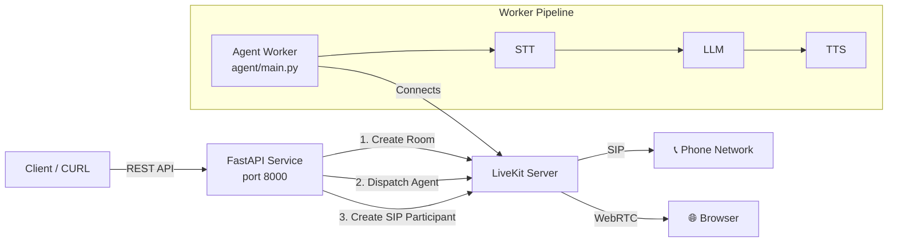
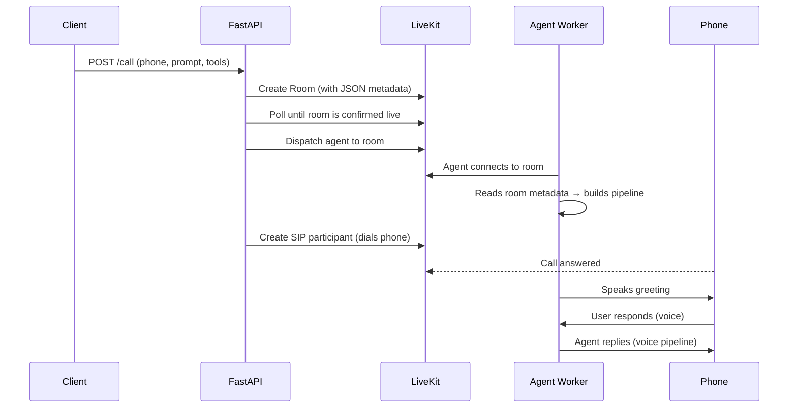
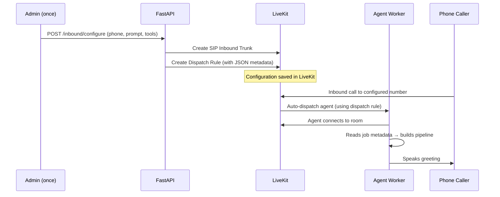

# Architecture

LiveKit Voice Agent is built on two independent services that communicate entirely through **LiveKit rooms and metadata**.

---

## Two-Service Design



| Service | File | Role |
|---|---|---|
| **FastAPI API** | `app/main.py` | Receives REST calls, orchestrates LiveKit API calls |
| **Agent Worker** | `agent/main.py` | Joins rooms, reads metadata, runs the voice AI pipeline |

These two services **do not communicate directly**. All coordination happens via LiveKit room state.

---

## Outbound Call Flow

When you `POST /call`, the following sequence happens:



**Key ordering rule**: The agent is dispatched and confirmed in the room *before* the phone is dialed. This prevents the agent from being unavailable when the call is answered.

---

## Inbound Call Flow

For inbound calls, configuration is set up once via `POST /inbound/configure`:



---

## Metadata as Configuration

The agent worker is stateless — all configuration is passed in the **room or job metadata** as a JSON object:

```json
{
  "system_prompt": "You are a helpful sales agent...",
  "tools": [...],
  "voice": "95d51f79-c397-46f9-b49a-23763d3eaa2d",
  "language": "en",
  "model_type": "standard",
  "stt_config": { "provider": "assemblyai", "config": {} },
  "llm_config": { "provider": "openai", "config": { "model": "gpt-4o" } },
  "tts_config": { "provider": "cartesia", "config": {} }
}
```

The agent parses this with `parse_metadata()` in `agent/main.py`. If meta is large, it's automatically compressed using **zlib + base64** (prefixed with `z:`).

---

## Recording and Transcripts

- **Recording**: When a SIP call is answered, a LiveKit Egress recording is started automatically.
- **Transcripts**: The agent collects conversation text during the session and uploads a transcript to **S3** at session end.

Both happen transparently without any additional API calls from the client.

---

## AGENT_NAME Matching

The `AGENT_NAME` environment variable is the critical link between the FastAPI service and the Agent Worker. When the API dispatches an agent, it uses this name. The Worker only picks up jobs that match its registered name.

```
FastAPI:  dispatch(agent_name="chinmay_agent")  ──→  LiveKit
Worker:   @server.rtc_session(agent_name="chinmay_agent")  ←── LiveKit
```

If these values differ, dispatches are silently dropped and calls never connect.
