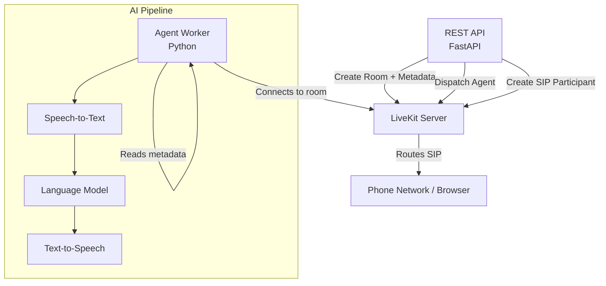

# LiveKit Voice Agent

**LiveKit Voice Agent** is a production-ready voice AI platform that lets you deploy an AI phone agent in minutes. It supports outbound dialing, inbound call handling, and browser-based voice sessions — all powered by LiveKit SIP and a fully configurable AI pipeline.

<CardGroup cols={2}>
  <Card title="Quickstart" icon="rocket" href="/quickstart">
    Get up and running in under 5 minutes
  </Card>
  <Card title="API Reference" icon="code" href="/api-reference/outbound-call">
    Explore all REST API endpoints
  </Card>
  <Card title="Pipelines" icon="microchip" href="/concepts/pipelines">
    Standard vs Realtime model pipelines
  </Card>
  <Card title="Dynamic Tools" icon="wrench" href="/concepts/tools">
    Give your agent access to external APIs
  </Card>
</CardGroup>

---

## What Can It Do?

| Feature | Description |
|---|---|
| **Outbound Calls** | Dial one or more phone numbers via SIP. Each call gets its own agent instance. |
| **Inbound Calls** | Configure phone numbers to be answered by the AI agent automatically. |
| **Web Calls** | Browser-based voice session — generate a token and connect via the LiveKit SDK. |
| **Dynamic Tools** | Give the agent access to any external HTTP API at runtime. |
| **Multi-provider** | Swap STT, LLM, and TTS providers per call without changing code. |
| **Call Recording** | Automatic room recording via LiveKit Egress. |
| **Transcripts** | Full conversation transcripts uploaded to S3. |

---

## System Architecture

The platform is split into two independent services that communicate through LiveKit:

**FastAPI Service** (`app/`) handles REST API requests — it creates rooms, dispatches agents, and dials phone numbers via LiveKit's API.

**Agent Worker** (`agent/`) is a long-running LiveKit agent process. It connects to assigned rooms, reads configuration from room metadata, builds the AI pipeline dynamically, and handles the voice conversation.

---

## How Metadata Flows

All configuration (system prompt, tools, voice, model provider) is passed via **LiveKit room metadata** — a JSON blob attached to the room at creation time. The agent worker reads this metadata when it joins and configures itself accordingly.

This means you can give each call a completely different personality, voice, language, and tool set — with zero code changes.

---

## Next Steps

<CardGroup cols={2}>
  <Card title="Installation" icon="download" href="/installation">
    Set up the project from scratch
  </Card>
  <Card title="Configuration" icon="gear" href="/configuration">
    Configure your environment variables
  </Card>
</CardGroup>
